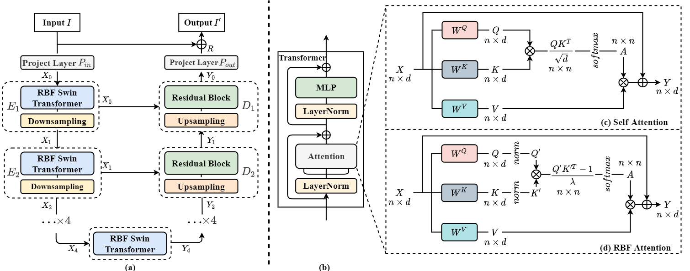

## Hybrid Transformer-CNN for Real Image Denoising  

paper: 



### Training

```python
python main_train.py --arch "RBF_TECDNet_S" --pth_dir "./experiments/TECDNet" --data_dir "your train data dir" --log_dir "./runs" --is_warmup True --augment True --img_size=128 --batch_size 32 --n_epochs 250
```

### Testing

### Contact

If you have any questions, please contact me(koblod@163.com).